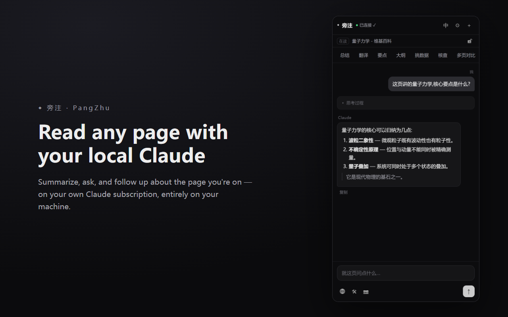
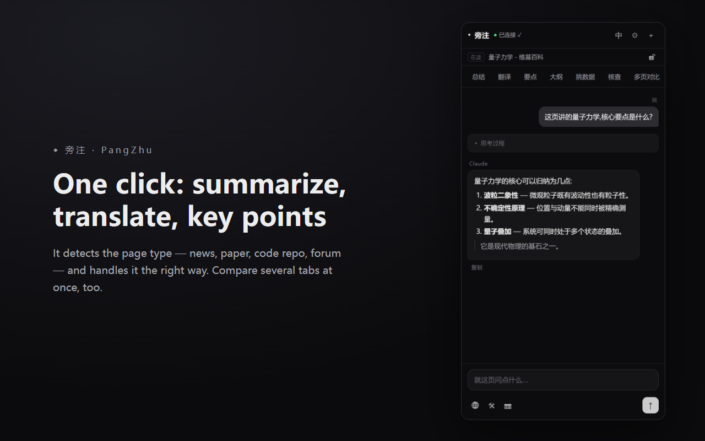
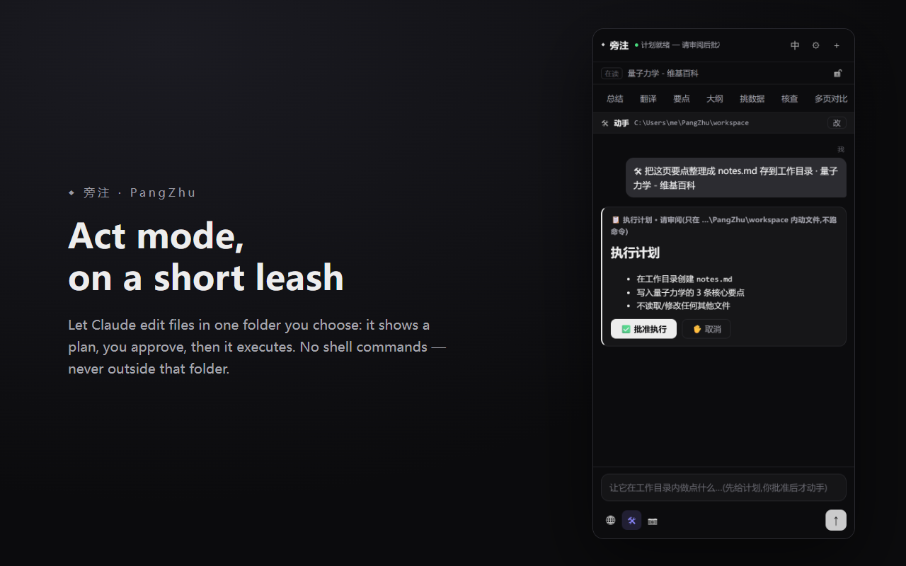

# 旁注 · PangZhu

<p align="center">
  
</p>

> **A Microsoft Edge side panel that reads the page you're on — using the Claude Code CLI on your own machine.** Summarize, translate, ask, compare tabs, with optional sandboxed file edits and web search. **Local-only · your own Claude subscription · no extra API cost · no server · no telemetry.**
>
> **Edge 侧边栏里用你本地的 Claude 读当前网页** — 总结、翻译、问答、多页对比,可选放权动手与联网查证。**纯本地 · 走你自己的订阅 · 不花一分额外 API 钱 · 无服务器 · 无遥测。**

**[English](#english)** · **[中文](#中文)**

> ⚠️ A personal, **as-is** hobby project — issues and PRs are welcome, but responses and merges are not guaranteed.
> 个人业余项目,按 **as-is** 提供;欢迎 issue / PR,但**不保证回复或合并**。

---

<a name="english"></a>
## English

### What it does

- **Chat about the current page** — ask anything, with the page's content attached automatically, and keep following up.
- **One-click actions** — Summarize, Translate, Key points, Outline, Extract data, Fact-check. It first detects the page type (news / paper / code repo / forum…) and handles it the right way.
- **Multi-page compare** — read several open tabs and synthesize their key points, commonalities, and differences.
- **Ask about a selection** — select text on a page, right-click, and ask about exactly that.
- **Vision** — optionally attach a screenshot of the current screen so it can "see" this view (charts, error screenshots…).
- **Bilingual answers** (Chinese / English), one click to switch.
- **Web search** (optional) — let Claude search the web to verify before answering.
- **Act mode** (optional, strictly sandboxed) — let Claude read and write files inside **one folder you choose**: it shows a plan, you approve, then it executes. It can only work inside that folder and **cannot run any shell commands**.

### Screenshots

| One-click summarize / translate / key points | Act mode: plan → approve → execute |
| :---: | :---: |
|  |  |

### How it works

```
Edge side panel ──(Native Messaging)──> a small local host (Node) ──> your real claude.exe
   page text / selection / screenshot / url        streams the answer back, token by token
```

- The browser launches the local host automatically. It opens **no network port** and runs no background service.
- The default chat session runs **read-only** with **all tools disabled**; even prompt injection on a page can, at worst, make the answer wrong — it cannot touch your machine.
- **Act mode** and **web search** are explicit opt-in toggles, each with hard limits (see above).

### Requirements

- **Windows + Microsoft Edge** (the installer writes an Edge registry entry).
- **Claude Code** installed and signed in (the `claude` command works in a terminal).
- **Node.js** installed (the host runs on node).

### Install

PangZhu has two parts: the **browser extension** (UI) + a **local companion** (bridge to your claude.exe). Install both once.

1. **Install the extension** — from the Microsoft Edge Add-ons store, or load it unpacked (`edge://extensions` → Developer mode → Load unpacked → pick `extension/`).
2. **Install the companion** — unzip the companion package and **double-click** `scripts\install.cmd`. It auto-detects `claude.exe` and `node` and registers the Native Messaging host.
3. **Fully quit and reopen Edge**, click the ◆ PangZhu toolbar icon — the status should read "已连接" (Connected).

### Privacy & security

Page content is sent **only** to the Claude running on your own computer — never to the developer's servers, with no telemetry. The default chat session has all tools disabled; web search and act mode are explicit opt-ins. See [PRIVACY.md](PRIVACY.md).

### Contributing

Issues and PRs are welcome, but this is a hobby project — **timely responses or merges are not guaranteed.** When filing an issue, include your Edge version, OS, steps to reproduce, and the relevant lines from `host\pagetalk-host.log`.

### License

[MIT](LICENSE) © 2026 moonstack

---

<a name="中文"></a>
## 中文

### 工作原理

```
Edge 侧边栏 ──(Native Messaging)──> 本地小帮手(Node)──> 你真正的 claude.exe
   抓页面文字/选中/截图/网址                逐字把回答流回侧边栏
```

- 浏览器**自动拉起**小帮手,不开任何网络端口、不常驻后台服务。
- 聊天默认起一个**纯只读**的 `claude` 会话(headless 流式、禁用全部工具与 MCP);页面里就算有提示注入,最坏只是答得不准,**碰不了你的电脑**。
- 「放权动手」「联网搜索」是**显式开关**,各有硬性边界(见下)。

### 前置要求

- **Windows + Microsoft Edge**(安装脚本写 Edge 的注册表项)。
- 已安装并登录 **Claude Code**(命令行能跑 `claude`)。
- 已安装 **Node.js**。

### 安装

旁注分两部分:**浏览器扩展**(界面)+ **本地配套程序**(桥接到你的 claude.exe)。两部分各装一次。

1. **装扩展**:从 Microsoft Edge 外接程序商店安装;或开发者方式 `edge://extensions` → 开发人员模式 →「加载解压缩的扩展」→ 选 `extension` 文件夹。
2. **装配套程序**:解压配套包,**双击** `scripts\install.cmd`(自动定位 `claude.exe` 与 `node`,写入原生消息宿主)。
3. **完全退出并重开 Edge**,点 ◆ 旁注 图标,状态显示「已连接」即可。

### 功能

- **读网页对话**:就当前这一页直接提问,自动带上下文,可连续追问。
- **一键动作**:总结 / 翻译 / 要点 / 大纲 / 挑数据 / 核查——先判断页面类型(新闻 / 论文 / 代码仓库 / 论坛…)再用最合适的方式处理。
- **多页对比**:把当前窗口的多个网页一起读,做要点、共同点与差异综合。
- **选中即问**:网页里选中文字 → 右键直接就那段发问。
- **看图**:可附带当前屏幕截图,让它「看」这一屏。
- **中英双语**回答,一键切换。
- **联网搜索**(可选):让 Claude 上网查证再回答。
- **放权动手**(可选,严格受限):让 Claude 在**你指定的一个目录内**读写文件——先给计划,你批准,才执行;只能在该目录内、**不能执行任何命令**。

### 隐私与安全

页面内容只发给**你本机的** claude.exe,**不上传任何第三方**,无遥测。默认聊天会话禁用一切工具;联网与放权动手都是显式开关。详见 [PRIVACY.md](PRIVACY.md)。

### 常见问题

- **一直「连接中…」/「未连接」**:多半是装好后没重启 Edge。**完全退出 Edge** 再开;必要时重跑 `install.cmd`。
- **`edge://extensions` 写「服务工作进程(不活动)」**:**正常**。MV3 后台空闲会休眠,用到自动唤醒。
- **某页「正文为空」**:`edge://` 内置页等受限页面读不了,会自动降级为纯对话并提示。

### 卸载

运行 `scripts\uninstall.cmd` 删注册表项,并在 `edge://extensions` 移除扩展。

### 开发

```
host\        本地小帮手(Node):framing / claude-session / host
extension\   Edge MV3 扩展:sidepanel / options / shared / background
scripts\     install.cmd / uninstall.cmd
```

- 小帮手测试:`cd host && npm test`(11 个用例,不调真 claude)。
- prompt 拼装测试:`node --test extension/shared/compose.test.mjs`(8 个用例)。

### 名字

「旁注」= 页边的批注。它就是在你读的这一页**旁边**,帮你读、帮你想的那支笔。(原名 PageTalk / 页聊。)

### 许可 / License

[MIT](LICENSE) © 2026 moonstack
